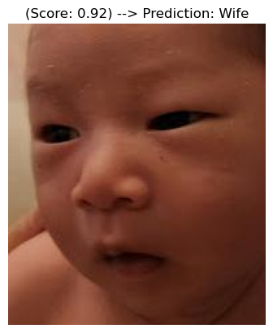
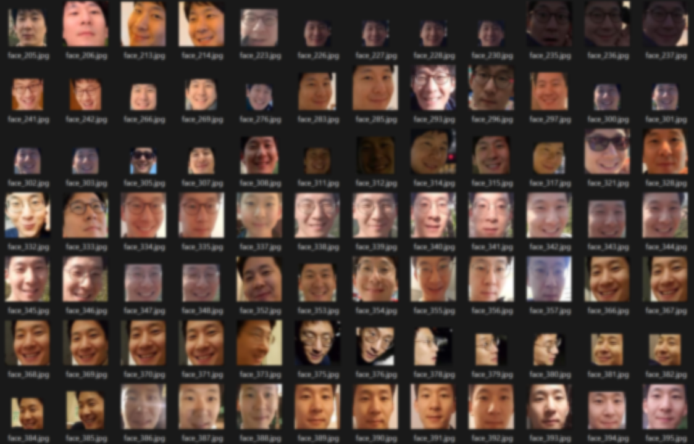
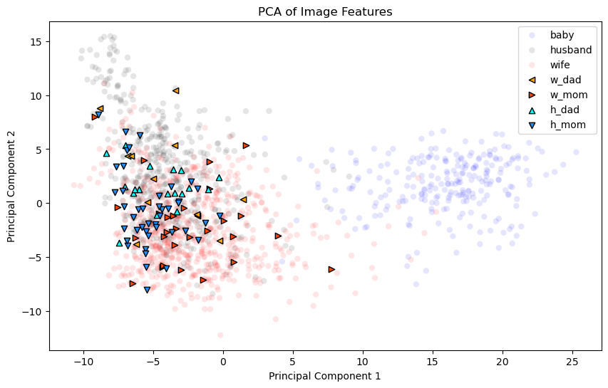

# Who Does my Baby Look Like? A Machine Learning's Answer to Family Resemblance

## Objective
The goal of this project is to provide my newborn baby's picture to a trained ML model and see what the model thinks about the picture—does the baby resemble me more or my wife? Sure, friends and family have their opinions, but why leave such an important question to chance?

By leveraging **deep learning** and **facial recognition**, I’ll train a neural network to settle the debate once and for all: is the baby a mini-me or more of a mama’s look-alike? 

### Here's the Plan:
- **Step 0**: Collect the data the model will be trained on.
- **Step 1**: Train a basic CNN model to distinguish between my face and my wife’s face.
- **Step 2**: Use this model to analyze our baby's features and decide who the baby takes after. - Plot the distribution of scores (under 0.5 means he resembles me, over 0.5 means he resembles my wife).
- **Step 3**: See how the pictures cluster. - Using Kmeans clustering.
- **Step 4**: Expand the training dataset to include the pictures of the baby's maternal and paternal grand parents and see if the baby resembles them more than me and my wife. 

Will our baby’s face an equal blend me and my wife's faces or a carbon copy of one parent? Perhaps he will resemble his grandparent more? Let's hear what the algorithm has to say.

### Example Output
Here's an example of what the output might look like:

In this example, the model has analyzed the baby's features and provided a score (Close to 1 means he resembles my wife. Close to 0 means he resembled me, the husband).

### Note on training data

The repository includes codes for acquiring training data using Google Photos API (data_acquisition.ipynb), but it will not run on other environments because it will not have access to API credentials.

The acquired data will look like this:

### Expansion

The project will expand to cover further analyses including PCA.

